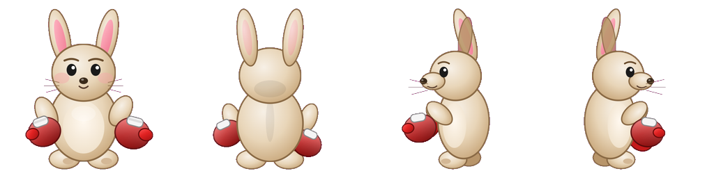

# 2D Game Studio (PydanticAI → Phaser)

Agent pipeline from the Sasin *2D Games with AI Agents* lecture: concept → mechanics → levels → HTML sprites (with critic) → Phaser 3 CDN game.



## What is a brief?

A **brief** is a small JSON file that tells the studio what game to build. It is the human input — one pitch, game type, constraints — before any agents run.

| Field | Purpose |
|-------|---------|
| `concept_sentence` | One-line story / pitch |
| `game_type` | `side_scroller` or `top_down` |
| `title_hint` | Optional working title |
| `output_folder` | Default `games/…` path (override with `--name`) |
| `critic_rounds` | How many screenshot→critic revise loops |
| `constraints` | Hard rules (levels count, hero, items, map size, art style…) |

Example brief (shipped in this repo): [`briefs/rabbit_side_scroller.json`](briefs/rabbit_side_scroller.json)

```json
{
  "concept_sentence": "A brave boxing rabbit must reclaim the stolen carrot harvest from sneaky snakes — punch them or jump on their heads, snack on carrots for health, and find easter eggs that power up its punch.",
  "game_type": "side_scroller",
  "title_hint": "Rabbit Punch Valley",
  "output_folder": "games/rabbit_punch_valley",
  "critic_rounds": 1,
  "constraints": [
    "Exactly 2 side-scrolling levels",
    "Hero is a boxing rabbit",
    "Enemies are snakes that can be punched or stomped",
    "Carrots restore health",
    "Easter eggs increase punch strength",
    "Give a short story about what the rabbit wants (save the harvest / village feast)",
    "Keep maps tiny and finishable (width about 36-45 tiles)",
    "Cute readable art style, high contrast, DETAILED character sprites (face, gloves, limbs)",
    "sprite_poses must include left/right idle, run, punch, hurt, and jump",
    "Include at least a few carrots, easter eggs, and snakes in each level"
  ]
}
```

Copy that file, edit the sentence + constraints, and point `python -m studio` at your new brief.

## Project folder setup

You want a workspace that looks like this:

```
my_game_workspace/          ← you create this
  .env                      ← OPENAI_API_KEY (not committed)
  .venv/                    ← Python virtualenv
  studio/                   ← this repo (cloned)
  briefs/                   ← your brief JSON files
  games/                    ← generated Phaser games land here
```

### Step by step

```bash
# 1) Make a workspace folder
mkdir my_game_workspace
cd my_game_workspace

# 2) Clone this studio into it
git clone https://github.com/zlisto/game_phaser_agent.git studio_repo
# Option A — work inside the clone (simplest):
cd studio_repo

# 3) Folders for briefs + outputs (clone already has briefs/ and games/)
#    If you started from an empty folder instead:
# mkdir briefs games

# 4) Python env + deps
python -m venv .venv
# Windows:
.venv\Scripts\activate
# macOS / Linux:
# source .venv/bin/activate
pip install -r requirements.txt
playwright install chromium

# 5) API key (repo root OR studio/.env)
cp .env.example .env
# edit .env → OPENAI_API_KEY=sk-...
```

**Simplest path:** clone the repo, activate a venv, add `.env`, run against `briefs/rabbit_side_scroller.json`. The clone already includes `briefs/` (example) and `games/` (empty output dir).

If you keep briefs outside the clone, pass a full path:

```bash
python -m studio path/to/briefs/my_game.json --name my_game --root .
```

## Run

From the **repo root** (folder that contains `studio/` as a package):

```bash
# Cheap draft (default model: gpt-5.6-luna)
python -m studio briefs/rabbit_side_scroller.json --name rabbit_punch_valley_luna

# Stronger models into their own folders
python -m studio briefs/rabbit_side_scroller.json --model gpt-5.6-terra --name rabbit_punch_valley_terra
python -m studio briefs/rabbit_side_scroller.json --model gpt-5.6-sol --name rabbit_punch_valley_sol
```

`--name` writes under `games/<name>/` so luna / terra / sol runs don’t overwrite each other.

### Flags

| Flag | Meaning |
|------|---------|
| `--model` | OpenAI model id (`gpt-5.6-luna`, `gpt-5.6-terra`, `gpt-5.6-sol`, or `openai:…`) |
| `--name` | Output folder under `games/` |
| `--art-from` | Rebuild art from an existing game’s `data/` |
| `--critic-rounds` | Critic revise loops (default `1`) |
| `--root` | Workspace root (default: cwd) |

### Play the game

```bash
cd games/rabbit_punch_valley_luna
npx --yes serve .
```

Open the printed `http://localhost:…` URL — do **not** use `file://`.

## Pipeline

1. **Concept Agent** → `data/concept.json`
2. **Mechanics Agent** → `data/mechanics.json` (includes `sprite_poses`)
3. **Levels Agent** → `data/levels.json` + `layout_preview.html`
4. **Art Agent** → pose names + detailed descriptions
5. **HTML + Critic** → lock `*_base.html` → pose from that HTML (parallel) → screenshots → sprite sheets
6. **Assembler** → Phaser 3 CDN project

Supports `side_scroller` and `top_down` via the brief’s `game_type`.

Model used is written to `data/run_meta.json`.

## Cost note (tiny rabbit demo)

Same brief (2 levels, one snake type), ballpark:

| Model | Cost | Time | Notes |
|-------|------|------|--------|
| luna | ~$0.15 | ~1–2 min | Cheapest; sprites often uglier |
| terra | ~$1.50 | ~1–2 min | Similar quality to sol on this demo |
| sol | ~$5.50 | ~5 min | Slow + spendy for similar look |

## License

Course / teaching material — add a license of your choice before publishing publicly.
